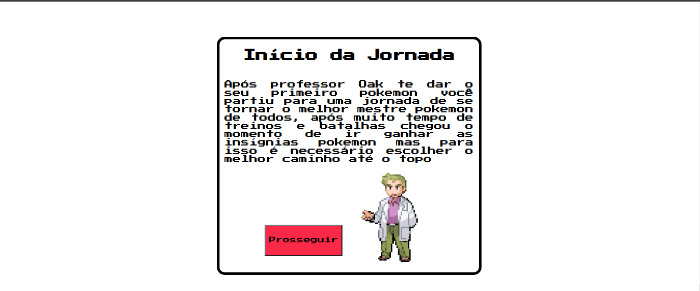
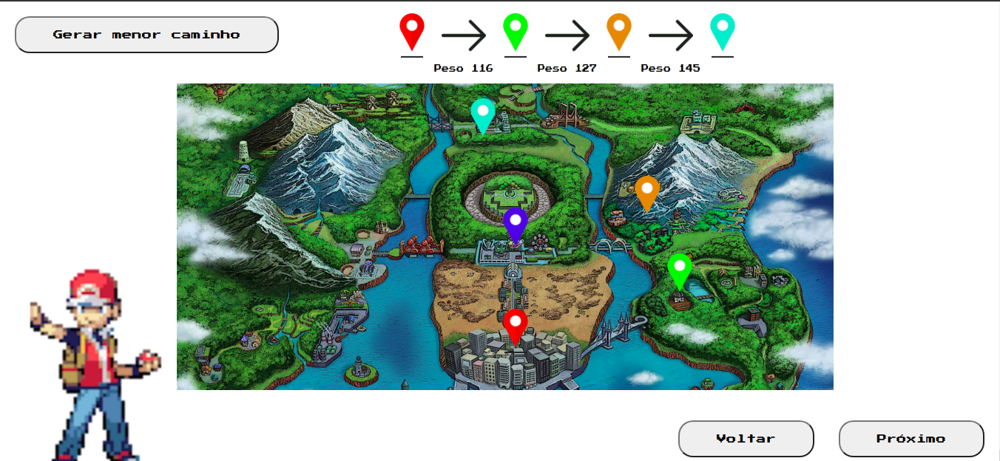
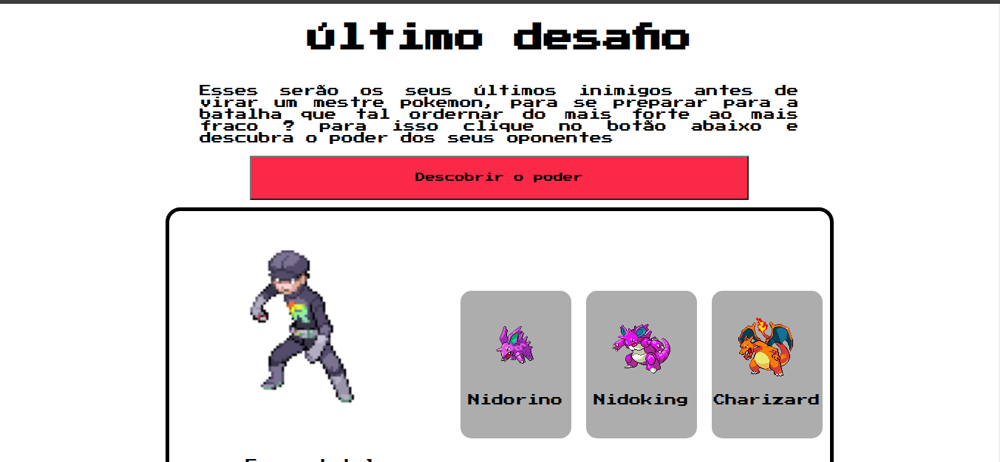

# Poke Aventura

**Número da Lista**: 6 
**Conteúdo da Disciplina**: Final 

## Alunos
|Matrícula | Aluno |
| -- | -- |
| 15/0120630  |  Caio Oliveira de Moraes |
| 16/0015294  |  Matheus Rodrigues do Nascimento |

## Sobre 
O projeto conta a historia de uma aventura de um mestre pokemon, e o projetp tem intuimo de mostrar o menor caminho que esse treinador deve tomar utilizando o algoritmo de Dijkstra e também utilizando o algoritmo de merge sort para mostrar qual a sequencia ideal de inimigos que o meste deve emfrentar para obter sucesso na sua jornada. 

## Screenshots

## Instalação 
**Linguagem**: Javascript 
**Framework**: React 
Descreva os pré-requisitos para rodar o seu projeto e os comandos necessários.

## Uso 

Instale as dependencias

`yarn `

Rode a aplicação com o comando 

`yarn start`

Acesse o poke aventura na página

`localhost:3000`

## Uso 
Para utilizar a aplicação apenas clique no botão proseguir para ver o próximo passo da aventura

